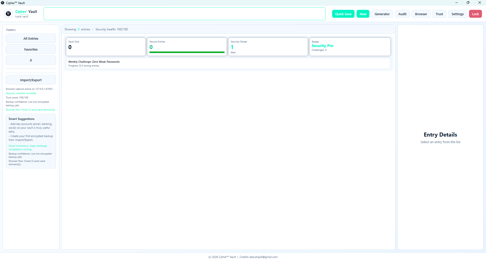

# CipherVault — Local-First Encrypted Password Manager

A production-ready, Windows-only password manager built with .NET 8, WPF (MVVM), SQLite, Argon2id, and AES-256-GCM.

---

## Screenshot



## Features

- **Local-first vault** — all data is encrypted on disk; no cloud sync required
- **AES-256-GCM** authenticated encryption per entry (tamper-evident)
- **Argon2id** key derivation (256 MB memory, 3 iterations by default)
- **Encrypted backup/export** with independent export password
- **CSV import** from Bitwarden/KeePass with privacy warning
- **Password generator** (cryptographically secure RNG)
- **Password audit** — weak, missing char classes, reuse detection (in memory only)
- **Fix Queue auto-remediation** — one-click "Auto Secure" rotation with password history safety
- **Clipboard auto-clear** (configurable, only clears if still contains app's value)
- **Auto-lock** after configurable idle timeout
- **Optional browser capture** (Chrome/Edge load-unpacked extension, localhost only, approval by default with optional silent/domain auto-save)
- **Dark/Light theme** UI with MVVM architecture
- **No keylogging** and no hidden data collection

---

## Threat Model

| Threat | Mitigation |
|---|---|
| Stolen vault file | All entries encrypted with AES-256-GCM; key derived from master password via Argon2id |
| Brute-force master password | Argon2id with 256 MB RAM + 3 iterations makes GPU cracking very expensive |
| Tampered ciphertext | AES-GCM authentication tag verified on every decrypt; throws `AuthenticationTagMismatchException` |
| Compromised RAM snapshot | Key is zeroed on lock/exit; clipboard is cleared on lock |
| Weak/reused passwords | Audit service checks in memory only — no hash stored on disk |
| Insecure export | Export uses its own Argon2id + AES-GCM with separate password |
| CSV import exposes plaintext | User is warned; CSV is immediately encrypted into vault |
| Password breach | Optional opt-in HIBP k-anonymity check — only 5-char SHA-1 prefix sent |

---

## Crypto Design

### Key Derivation
```
master_password + random_salt (16 bytes)
    → Argon2id(memory=256MB, iterations=3, parallelism=min(cores,4))
    → 32-byte AES key (held in memory only)
```

### Per-Entry Encryption
```
JSON blob { username, password, notes, url, tags, totp_secret }
    → AES-256-GCM(key, random_nonce_12_bytes)
    → stored as: [nonce(12)] + [tag(16)] + [ciphertext]
```

Only the entry **title** is stored in plaintext (for search). An optional "Encrypt titles too" mode exists in VaultMeta.

### Vault Unlock Verification
A "canary" record `"CIPHERVAULT_CANARY_OK"` is encrypted with the derived key and stored in `vault_meta.canary_blob`. On unlock, this is decrypted to verify the master password is correct without storing the password itself.

### Backup Format
```
[magic: CPHRBAK1 (8 bytes)]
[salt: 16 bytes]
[argon memory MB: 4 bytes little-endian]
[argon iterations: 4 bytes]
[argon parallelism: 4 bytes]
[AES-256-GCM encrypted JSON payload]
```

---

## How Unlock Works

1. User enters master password
2. App reads `argon_*` parameters and `salt` from `vault_meta`
3. Argon2id derives a 32-byte key from password + salt
4. App decrypts `canary_blob` with the derived key
5. If decryption succeeds and canary value matches → vault is unlocked, key held in memory
6. If decryption fails → "Incorrect password" is shown; key bytes are zeroed

---

## Windows Hello (Phase 2)

When enabled:
1. On first successful password unlock, a random "wrapped key" is generated
2. The vault's derived key is encrypted with this wrapped key
3. The wrapped key is protected using Windows Hello (DPAPI/Credential Locker)
4. On subsequent unlocks, Windows Hello authenticates the user, unwraps the key, and decrypts the vault
5. Master password is still required after reboot or policy timeout — biometrics do NOT replace it

---

## Safe Import Guidance

### Importing from Bitwarden / KeePass CSV

âš  **WARNING: CSV files store passwords in PLAINTEXT.**

1. Export CSV from your old manager
2. Import into CipherVault (passwords are immediately encrypted)
3. **DELETE the CSV file immediately after import**
4. Consider using a secure file deletion tool (e.g., `cipher /w` on Windows)
5. Clear any browser download history that cached the file

### Importing from another CipherVault vault (.cipherpw-backup)
This format is fully encrypted. Use the export password you set when creating the backup.

---

## Breach Check (Phase 2)

When opt-in breach check is enabled in Settings:
- User triggers a manual check for each entry
- SHA-1 hash of the password is computed locally
- Only the **first 5 hex characters** are sent to the HIBP API (k-anonymity)
- The full hash is compared locally against the returned list
- **No full password or full hash is ever transmitted**
- If the feature is disabled, the app is 100% offline

---

## Database Schema

Vault file extension: `.cipherpw` (SQLite database)

```sql
vault_meta      -- salt, argon params, canary blob
entries         -- title (plaintext), encrypted_blob (everything else)
folders         -- folder name and id
app_settings    -- clipboard clear time, auto-lock, theme, etc.
```

---

## Setup & Running

### Prerequisites
- Visual Studio 2022 (v17.8+)
- .NET 8 SDK
- Windows 10/11 (WPF requirement)

### Steps
1. Clone the repository
2. Open `CipherVault.sln` in Visual Studio
3. Restore NuGet packages (automatic on build)
4. Set `CipherVault.UI` as the startup project
5. Press **F5** to build and run

### Vault Location
The default vault is created at:
```
%APPDATA%\CipherVault\vault.cipherpw
```

### Browser Capture Setup (Chrome/Edge)
1. Unlock CipherVault and click the `Browser` button in the main toolbar.
2. In Chrome/Edge, open extensions page and enable Developer Mode.
3. Load unpacked extension from:
```
CipherVault.UI/bin/Debug/net8.0-windows/BrowserExtension/chrome
```
4. On login form submit, CipherVault shows a save prompt by default; choosing Yes saves immediately.
5. Optional: enable Silent Mode or set auto-save domains in Settings for faster flow.

---

## NuGet Packages

| Package | Version | Purpose |
|---|---|---|
| `Konscious.Security.Cryptography.Argon2` | 1.3.1 | Argon2id key derivation |
| `Microsoft.Data.Sqlite` | 8.0.8 | SQLite access |
| `Microsoft.Extensions.DependencyInjection` | 8.0.0 | DI container |
| `Microsoft.Extensions.Logging` | 8.0.0 | Structured logging |
| `CommunityToolkit.Mvvm` | 8.2.2 | MVVM helpers |
| `Otp.NET` | 1.4.0 | TOTP generation (Phase 2) |
| `xunit` | 2.6.1 | Unit tests |

---

## Keyboard Shortcuts

| Shortcut | Action |
|---|---|
| `Ctrl+F` | Focus search bar |
| `Ctrl+N` | New entry |
| `Ctrl+L` | Lock vault |

---

## Security Notes

- The master password is **never stored** anywhere — not on disk, not in memory after key derivation
- Key material is zeroed using `Array.Clear` on lock/exit
- Logs contain **no sensitive data** (titles, usernames, passwords are never logged)
- Clipboard is only cleared if it still contains the app's last copied value (avoids disrupting other work)
- The app is Windows-only by design, enabling use of Windows security APIs in Phase 2

---

## UI Color Scheme (Current Theme)

| Token | Hex |
|---|---|
| Background | `#F9FDFF` |
| Background Alt | `#EAF4FF` |
| Surface | `#FFFFFF` |
| Surface High | `#F4F9FF` |
| Accent | `#1AA8FF` |
| Accent Hover | `#0D93E5` |
| Border | `#D2E3F3` |
| Text Primary | `#12253A` |
| Text Secondary | `#5D7692` |
| Success | `#2BBE9B` |
| Danger | `#E15C73` |

## Credits

Copyright (c) 2026 CipherVault
Credit: aboutsajid@gmail.com


